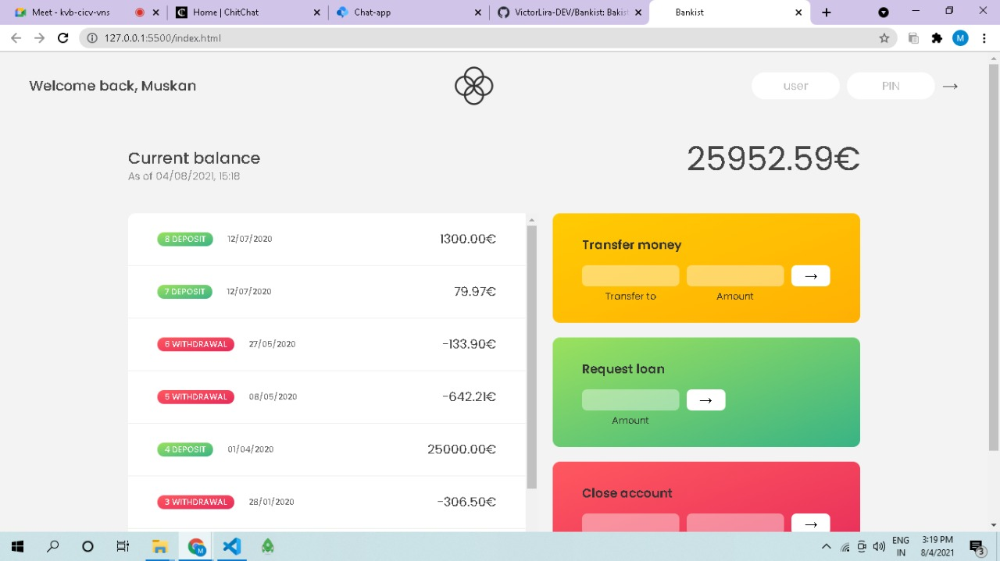

## **<h2 align="center">Bankist App 💻</h2>**

# 💸 Banskist

<h1 align="center">
    
</h1>

# Important

🔑 How to Login

User : mg  
Password : 3001

User : jd  
Password : 2222

---

🚀 Technologies used:

---

## ⭐ Features

- [x] Login, Logout
- [x] Transfer money
- [x] request loan
- [x] close account

---

## 📝 About

The Bankist Web-app is a basic banking model of two sample user accounts where the user can Transfer account from one account to the other, request for loan and delete his/her account.
